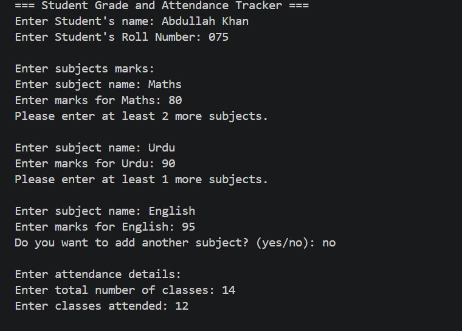
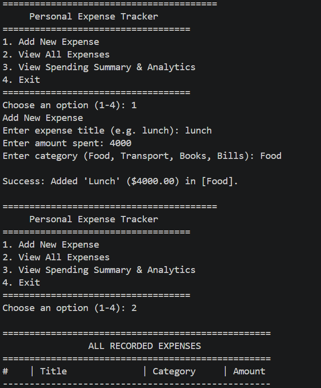

# ieee-lgu-aiml-week1-abdullah-khan
Name is: Muhammad Abdullah Khan 
Projects I have chosen is: Student Grade & Attendance Tracker and Personal Expense Tracker
The first project I chosen acts as an automated school report card generator. It focuses on taking numerical data, processing it, and determining an outcome based on specific rules. 
The second project I chosen acts as a mini financial budgeting application. It focuses on data logging, storage, and continuous user interaction through an interactive menu.
First Project Output proof: 
.png)
Second Project Output proof: 
.png)
.png)
